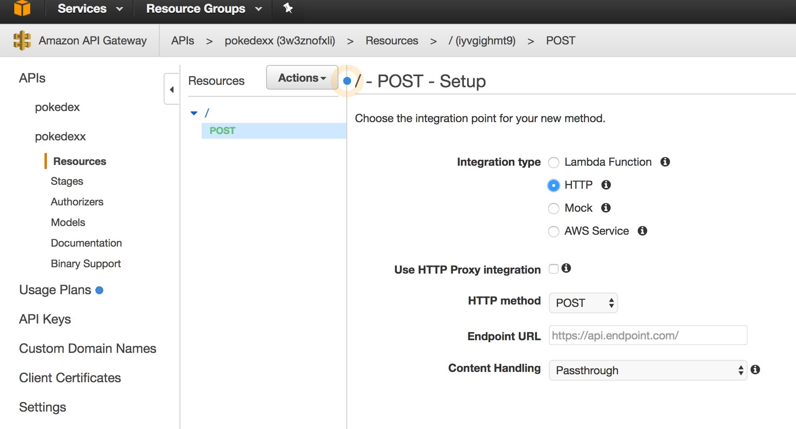
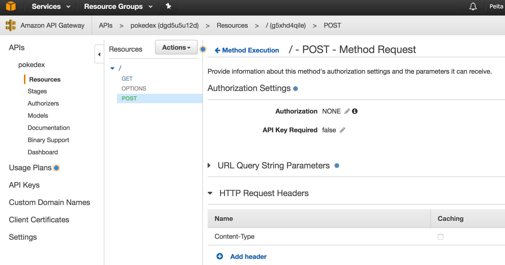
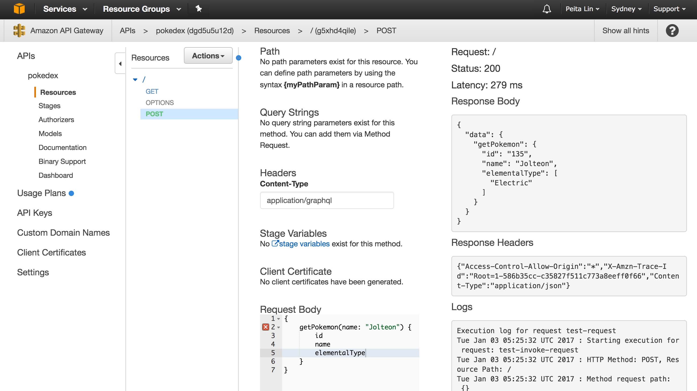
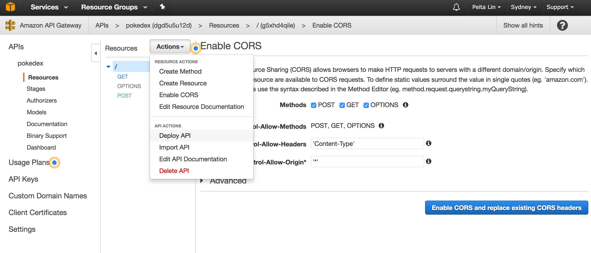

# Pokedex GraphQL api with PostgresQL backend

This template sets up a GraphQl Api for pokemon using graphql-express server and a Postgresql database on AWS.

## GraphQl-express server to query AWS postgresql database

Start GraphiQL:
```
yarn install; # or npm install
yarn start;
```

Then visit this url in your browser:
`localhost:4000/graphql`

Now try a Graphql query:
```
{
  Pokemon(name: "Magikarp") {
    id
    name
    img
    height
    weight
    elementalType
    elementalWeaknesses
    nextEvolution {
        name
        elementalWeaknesses
    }
  }
}
```

Try another! with fragments:

```
{
    metapod: getPokemon(name: "Metapod") {
    ...pokemonStats
    }
    kakuna: getPokemon(name: "Kakuna") {
    ...pokemonStats
    }
}

fragment pokemonStats on Pokemon {
    id
    name
    height
    weight
    img
    elementalType
    elementalWeaknesses
    nextEvolution
    prevEvolution
}
```


## Setting up a Postgresql/GraphQL backend on AWS RDS/EC2
Steps

### 1) Setup a postgresql database on AWS RDS:
[AWS RDS Postgresql Instructions]( http://docs.aws.amazon.com/AmazonRDS/latest/UserGuide/CHAP_GettingStarted.CreatingConnecting.PostgreSQL.html ).


### 2) Populate postgres database with pokedex data from `pokedex.csv`:

You should first go through `postgres_odo_example.py` and replace the username, password and database details as needed.
```
pip3 install pandas sqlalchemy;
python3 ./pokedex_postgres_data/postgres_odo_example.py
```

### 3) Boot up an EC2 instances and setup environment variables:
```
ssh -i '.pemkey' 'aws.ec2.instance.ip'
sudo apt install npm
echo "export AWS_RDS_HOST=xxxxxxxxxxxxxx.rds.amazonaws.com" >> ~/.bashid
echo "export AWS_RDS_PASSWORD=rds_password" >> ~/.bashid
source ~/.bashid
```

### 4) Open up ports on both EC2 server, and RDS database.
a) Make sure you open up inbound ports: 4000 on the EC2 server. Also open http, https ports.
[Redirect port 4000 to 80](http://stackoverflow.com/questions/16573668/best-practices-when-running-node-js-with-port-80-ubuntu-linode).

b) Open up all inbound ports on the RDS databse server (so that the graphql-express server running on EC2 can make requests to the RDS postgres database).


### 5) Run the GraphQL-Express server.
```
git clone https://github.com/peitalin/pokedex_graphql_postgres_EG
cd ./pokedex_graphql_postgres_EG
npm install
npm start
```
Or run as a service using `forever` package, so that it restarts when the instance reboots.


### 6) Enable AWS api gateway to allow CORS (cross origin requests)
In order to use this server for other web applications, you'll need to enable CORS on AWS api gateway.
Otherwise you won't be able to use the server as a GraphQL api for other applications.

#### a) Create a new API and add a method (POST) with integration type: HTTP


#### b) Make sure you set 'Content-Type' in Http Request Headers


#### c) Test a query
Set 'Content-Type' header as 'application/graphql'


#### d) Enable CORS
Set 'Access-Control-Allow-Headers' to 'Content-Type', and leave Access-Control-Allow-Origin to '\*' (or limit to your app domains).
Then hit 'Deploy API'.


You will recieve a new IP address which is now your API endpoint for graphql requests.
E.g. use this with ApolloGraphQL:
```
const client = new ApolloClient({
    networkInterface: createNetworkInterface({ uri: URL }),
})

```


## Additional Graphql Query Examples


Then visit this url in your browser:
`localhost:4000/graphql`

And try filtering pokemon by types:

```
{
    getPokemonByType(elementalType: "Fire") {
    ...pokemonStats
  }
}

fragment pokemonStats on Pokemon {
    id
    name
    height
    weight
    img
    elementalType
    elementalWeaknesses
    nextEvolution { name }
    prevEvolution { name }
}

```

Now see all pokemon which have an elemental advantage against a particular pokemon:
Charmander (fire) vs. Charizard (fire/flying)

```
{
    fireWeaknesses: getPokemonWithElementalAdvantage(name: "Charmander") {
    ...pokemonStats
  }
    fireFlyingWeaknesses: getPokemonWithElementalAdvantage(name: "Charizard") {
    ...pokemonStats
  }
}

fragment pokemonStats on Pokemon {
    name
    elementalType
}

```
